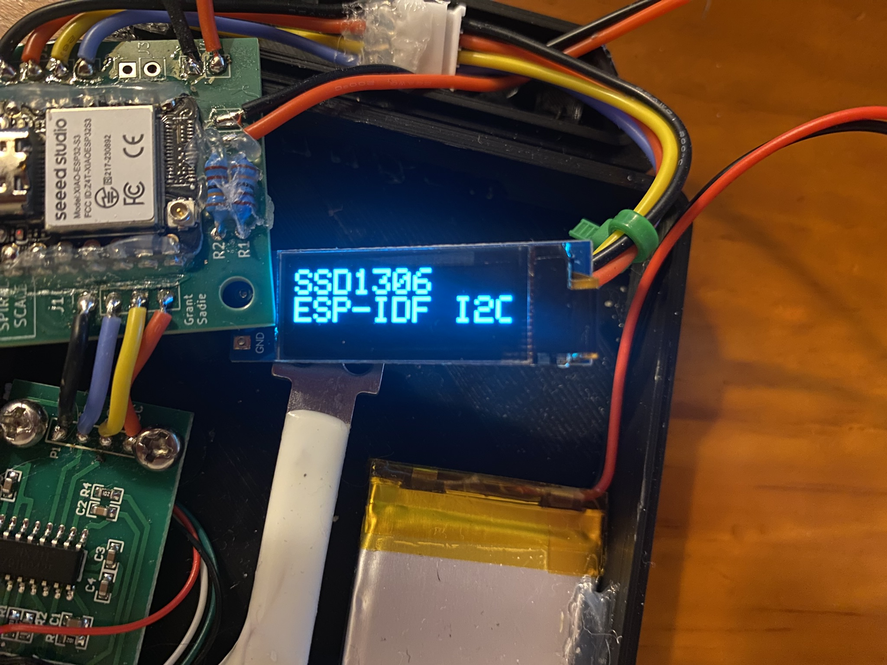

# SSD1306 128x32px C++ Component ESP-IDF
Library for interfacing with a 128x32 SSD1306 using the I2C protocol through ESP-IDF.

# Primary Sources
SSD1306 Datasheet  
https://cdn-shop.adafruit.com/datasheets/SSD1306.pdf

Inter-Integrated Circuit (I2C) ESP-IDF Guide  
https://docs.espressif.com/projects/esp-idf/en/stable/esp32/api-reference/peripherals/i2c.html

# Sample Images
  

# TODO
[ ] Add SPI support  
[ ] Add screen flipping  
[ ] Add scrolling  
[x] Upgrade to "i2c_master.h" from "i2c.h"  
[x] Add font size selection
